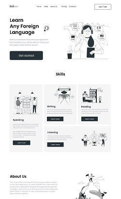

## Britlex
### Одна из первых моих работ на GitHub 

[GitHub Pages Britlex](https://vsamura.github.io/Britlex/)  

Данная работа задана для самостоятельной практики в ходе прохождения курса [*Frontend разработчик на HTML, CSS и JavaScript*](https://stepik.org/course/113402)  

## Связь со мной:

